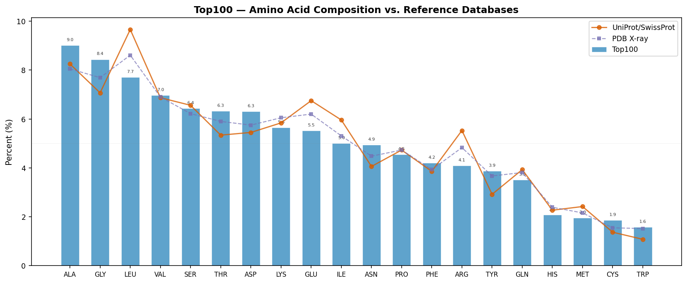
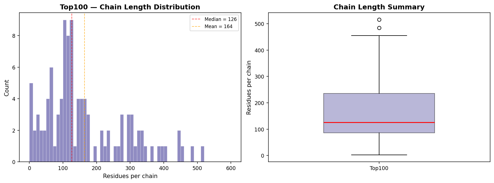
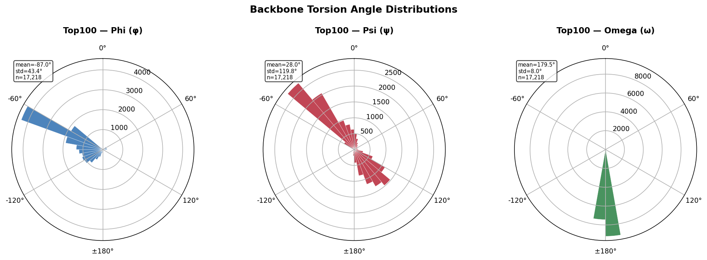
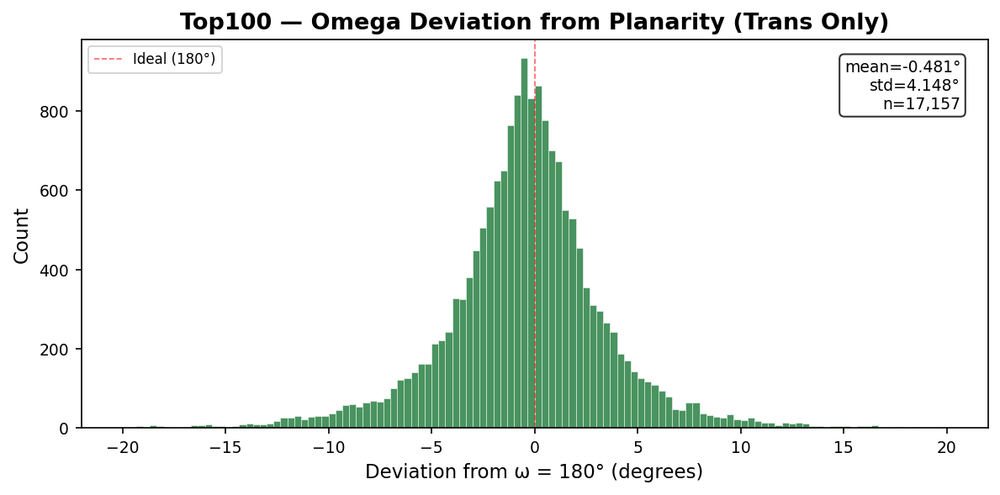
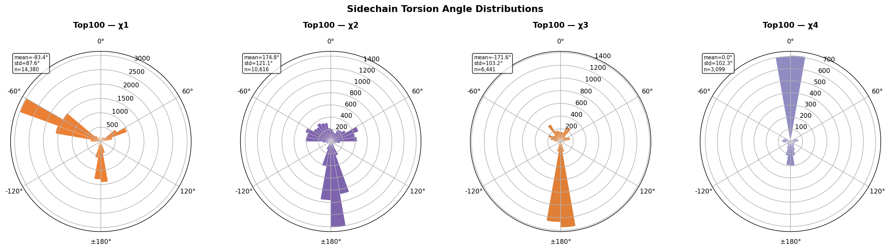
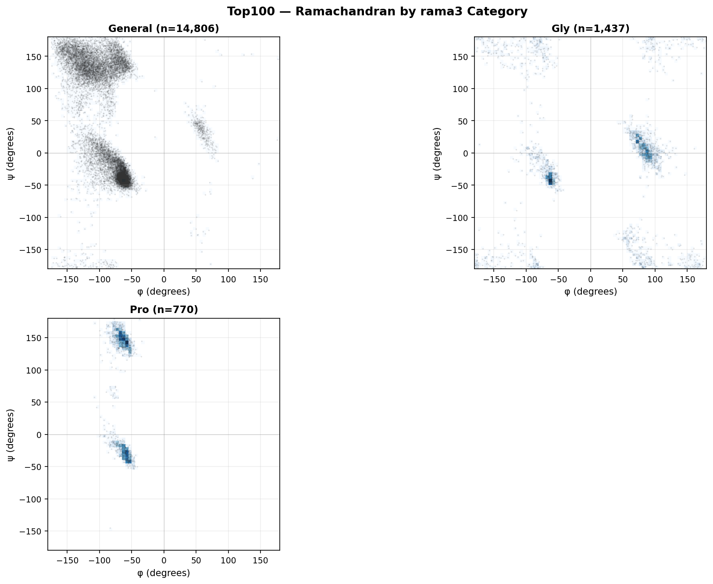
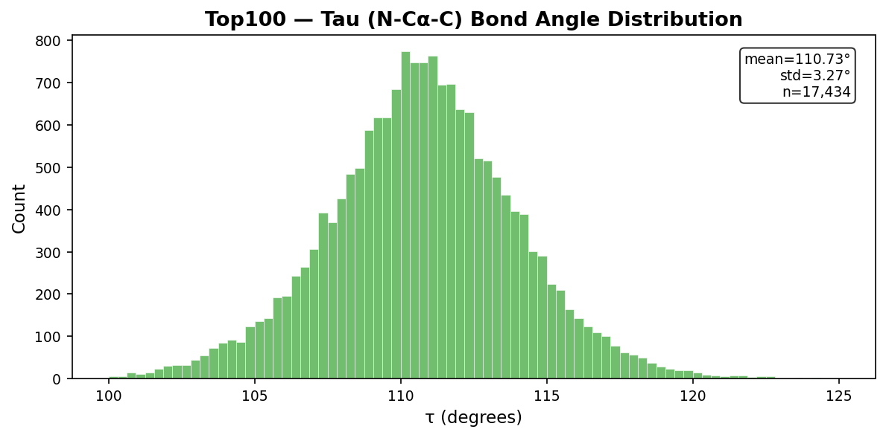

# Top100 Dataset — General Statistics and Geometric Analysis

**Residues:** 17,434 | **Chains:** 106 | **Structures:** 98
| **Source:** top100_measures.jsonl
| **Generated by:** pydangle-biopython v0.5.1

This document provides the following analyses:

1. **General Information** — dataset overview, measurements available, and summary statistics
2. **Amino Acid Composition and Chain Length Distribution** — comparison with UniProt and PDB reference databases
3. **Torsion Angle Distributions** — univariate (backbone, omega deviation, sidechain) and multivariate (Ramachandran) distributions using circular statistics
4. **Bond Angle Distributions** — tau (N−Cα−C) and other non-periodic angles using linear statistics
5. **References**

## 1. General Information

| | |
|---|---|
| **Dataset** | Top100 |
| **Total residues** | 17,434 |
| **Unique structures** | 98 |
| **Unique chains** | 106 |

**Measurements available:** phi: 17,218, psi: 17,218,
omega: 17,218, tau: 17,434, chi1: 14,380, chi2: 10,616, chi3: 6,441, chi4: 3,099.
Not all residues have all measurements — terminal residues lack phi/psi/omega,
and glycine and alanine lack sidechain chi angles.

    Ramachandran category distribution:
      General        12,187  (69.90%)
      IleVal          2,052  (11.77%)
      Gly             1,437  ( 8.24%)
      TransPro          720  ( 4.13%)
      PrePro            567  ( 3.25%)
      CisPro             50  ( 0.29%)
    
    Torsion angles (circular statistics):
      Angle             N    Circ Mean     Circ Std
      -------- ---------- ------------ ------------
      phi          17,218      -86.970       43.398
      psi          17,218       27.990      119.824
      omega        17,218      179.521        7.966
      chi1         14,380      -83.355       87.557
      chi2         10,616      174.761      121.133
      chi3          6,441     -171.584      103.209
      chi4          3,099        0.024      102.314
    
    Bond angles (linear statistics):
      tau          17,434      110.729        3.269

## 2. Amino Acid Composition and Chain Length Distribution

### 2.1 Representativeness

The figure and table below compare the Top100 amino acid frequencies against two
reference databases:

- **UniProt/SwissProt** (~2024): amino acid frequencies across all reviewed protein sequences,
  representing the broadest available view of protein sequence space.
- **PDB X-ray** (~2025): frequencies from a 10,000-entity sample of X-ray crystallographic
  structures in the RCSB Protein Data Bank.

The two reference distributions are highly similar (most amino acids differ by <0.5%),
indicating that the PDB's well-known crystallization bias — overrepresentation of soluble,
globular, well-expressing proteins from model organisms — has only a modest effect on
overall amino acid composition.

The Top100 dataset (17,434 residues from 98
structures) shows additional deviations from both references due to
quality filtering, homology reduction, and sample size effects.

    

    

    Residue     Count  Dataset%  UniProt%      PDB%  Δ UniProt
    -------- -------- --------- --------- --------- ----------
    ALA         1,570     9.01%     8.25%     8.05%     +0.76%
    GLY         1,471     8.44%     7.07%     7.69%     +1.37%
    LEU         1,343     7.70%     9.66%     8.61%     -1.96%
    VAL         1,215     6.97%     6.87%     6.90%     +0.10%
    SER         1,122     6.44%     6.56%     6.22%     -0.12%
    THR         1,102     6.32%     5.34%     5.90%     +0.98%
    ASP         1,099     6.30%     5.45%     5.75%     +0.85%
    LYS           985     5.65%     5.84%     6.05%     -0.19%
    GLU           963     5.52%     6.75%     6.20%     -1.23%
    ILE           872     5.00%     5.96%     5.31%     -0.96%
    ASN           862     4.94%     4.06%     4.48%     +0.88%
    PRO           792     4.54%     4.73%     4.73%     -0.19%
    PHE           732     4.20%     3.86%     3.93%     +0.34%
    ARG           714     4.10%     5.53%     4.83%     -1.43%
    TYR           676     3.88%     2.92%     3.67%     +0.96%
    GLN           613     3.52%     3.93%     3.81%     -0.41%
    HIS           364     2.09%     2.27%     2.39%     -0.18%
    MET           340     1.95%     2.42%     2.16%     -0.47%
    CYS           325     1.86%     1.37%     1.55%     +0.49%
    TRP           274     1.57%     1.08%     1.52%     +0.49%

### 2.2 Chain Length Distribution

    

    

    Chain length statistics (106 chains):
      Min:             2
      Q1:             86
      Median:        126
      Mean:        164.5
      Q3:            235
      Max:           516
      Std:         119.8

## 3. Torsion Angle Distributions (Circular Statistics)

Torsion angles (φ, ψ, ω, χ) are periodic variables defined on the interval
[−180°, +180°]. Standard (linear) arithmetic means and standard deviations
give misleading results when values cluster near the ±180° boundary — for
example, a linear mean of trans peptide bond ω values near +179° and −179°
yields ~0° rather than the correct ~180°. All torsion angle summary statistics
in this report use **circular statistics**: the circular mean is computed as
atan2(⟨sin θ⟩, ⟨cos θ⟩), and the circular standard deviation as √(−2 ln R̄)
where R̄ is the mean resultant length.

### 3.1 Univariate Distributions

#### 3.1.1 Backbone Torsion Angles (φ, ψ, ω)

    

    

#### 3.1.2 Omega Deviation from Planarity (Trans Peptides Only)

    

    

#### 3.1.3 Sidechain Torsion Angles (χ1–χ4)

    

    

### 3.2 Multivariate Distributions

#### 3.2.1 Ramachandran Distributions (φ × ψ by Category)

    

    

    
    Category counts (rama3):
      General        14,806  (84.93%)
      Gly             1,437  ( 8.24%)
      Pro               770  ( 4.42%)

## 4. Bond Angle Distributions (Linear Statistics)

Bond angles are non-periodic and are analyzed with standard linear
statistics (arithmetic mean, standard deviation).

### 4.1 Tau (N−Cα−C)

    

    

## 5. References

- Lovell, S. C., Davis, I. W., Arendall, W. B. III, de Bakker, P. I. W.,
  Word, J. M., Prisant, M. G., Richardson, J. S., & Richardson, D. C. (2003).
  Structure validation by Cα geometry: φ, ψ and Cβ deviation.
  *Proteins*, 50(3), 437–450. doi:10.1002/prot.10286

- Lovell, S. C., Word, J. M., Richardson, J. S., & Richardson, D. C. (2000).
  The penultimate rotamer library.
  *Proteins*, 40(3), 389–408. doi:10.1002/1097-0134

- Hintze, B. J., Lewis, S. M., Richardson, J. S., & Richardson, D. C. (2016).
  Molprobity's ultimate rotamer-library distributions.
  *Proteins*, 84(9), 1177–1189. doi:10.1002/prot.25039

- Williams, C. J., Headd, J. J., Moriarty, N. W., Prisant, M. G., Videau, L. L.,
  Deis, L. N., Verma, V., Keedy, D. A., Hintze, B. J., Chen, V. B.,
  Jain, S., Lewis, S. M., Arendall, W. B. III, Snoeyink, J., Adams, P. D.,
  Lovell, S. C., Richardson, J. S., & Richardson, D. C. (2018).
  MolProbity: More and better reference data for improved all-atom structure validation.
  *Protein Science*, 27(1), 293–315. doi:10.1002/pro.3330

- Word, J. M., Lovell, S. C., Richardson, J. S., & Richardson, D. C. (1999).
  Asparagine and glutamine: using hydrogen atom contacts in the choice of
  side-chain amide orientation. *Journal of Molecular Biology*, 285(4), 1735–1747.

- Davis, I. W., Leaver-Fay, A., Chen, V. B., Block, J. N., Kapral, G. J.,
  Wang, X., Murray, L. W., Arendall, W. B. III, Snoeyink, J.,
  Richardson, J. S., & Richardson, D. C. (2007).
  MolProbity: all-atom contacts and structure validation for proteins and nucleic acids.
  *Nucleic Acids Research*, 35(Web Server), W375–W383. doi:10.1093/nar/gkm216

- Edison, A. S. (2001). Linus Pauling and the planar peptide bond.
  *Nature Structural Biology*, 8(3), 201–202. doi:10.1038/84921

---

*Generated by pydangle-biopython v0.5.1 and the richardson-dataset-curation analysis pipeline.*

