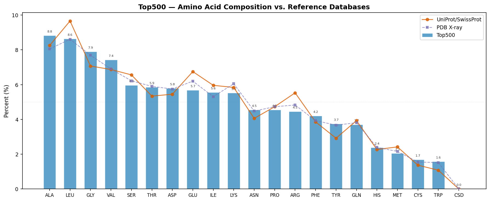
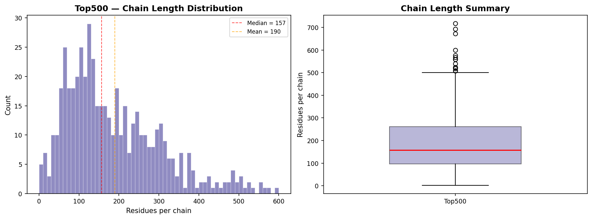
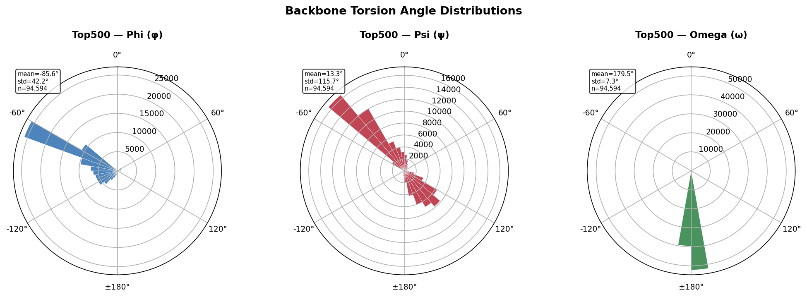
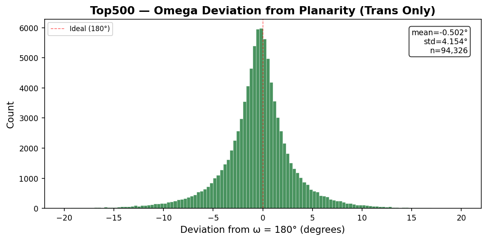
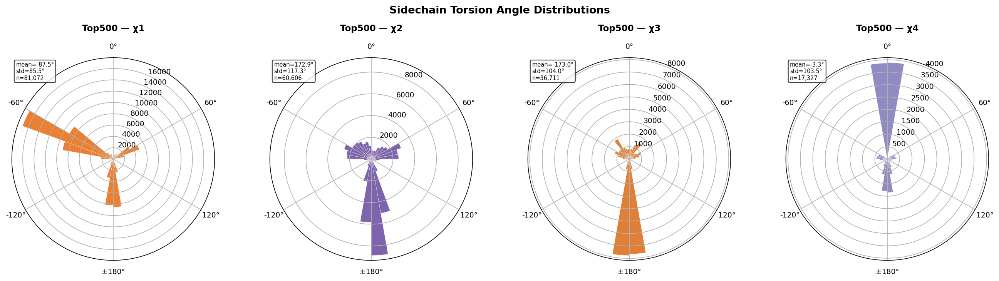
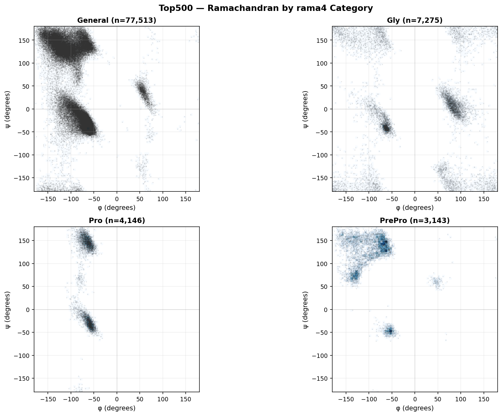
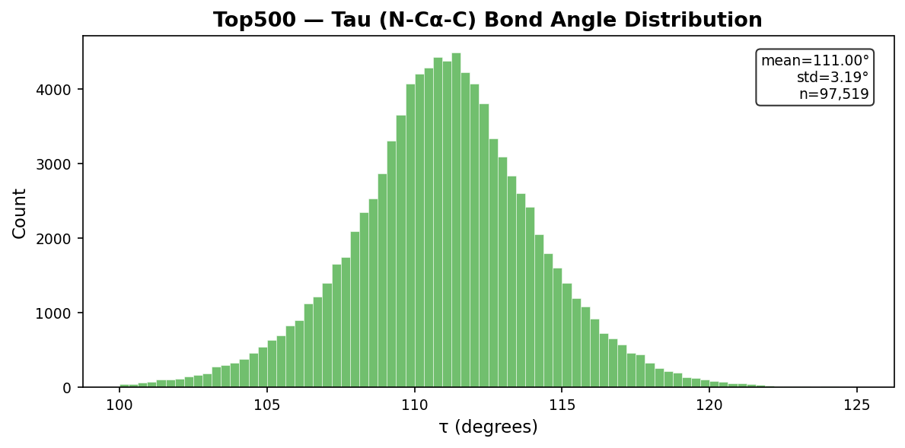

# Top500 Dataset — General Statistics and Geometric Analysis

**Residues:** 97,519 | **Chains:** 514 | **Structures:** 492
| **Source:** top500_measures.jsonl
| **Generated by:** pydangle-biopython v0.5.1

This document provides the following analyses:

1. **General Information** — dataset overview, measurements available, and summary statistics
2. **Amino Acid Composition and Chain Length Distribution** — comparison with UniProt and PDB reference databases
3. **Torsion Angle Distributions** — univariate (backbone, omega deviation, sidechain) and multivariate (Ramachandran) distributions using circular statistics
4. **Bond Angle Distributions** — tau (N−Cα−C) and other non-periodic angles using linear statistics
5. **References**

## 1. General Information

| | |
|---|---|
| **Dataset** | Top500 |
| **Total residues** | 97,519 |
| **Unique structures** | 492 |
| **Unique chains** | 514 |

**Measurements available:** phi: 94,594, psi: 94,594,
omega: 94,594, tau: 97,519, chi1: 81,072, chi2: 60,606, chi3: 36,711, chi4: 17,327.
Not all residues have all measurements — terminal residues lack phi/psi/omega,
and glycine and alanine lack sidechain chi angles.

    Ramachandran category distribution:
      General        65,472  (67.14%)
      IleVal         12,041  (12.35%)
      Gly             7,275  ( 7.46%)
      TransPro        3,927  ( 4.03%)
      PrePro          3,143  ( 3.22%)
      CisPro            219  ( 0.22%)
    
    Torsion angles (circular statistics):
      Angle             N    Circ Mean     Circ Std
      -------- ---------- ------------ ------------
      phi          94,594      -85.589       42.247
      psi          94,594       13.349      115.731
      omega        94,594      179.505        7.300
      chi1         81,072      -87.483       85.503
      chi2         60,606      172.912      117.293
      chi3         36,711     -172.964      103.976
      chi4         17,327       -3.292      103.523
    
    Bond angles (linear statistics):
      tau          97,519      111.000        3.190

## 2. Amino Acid Composition and Chain Length Distribution

### 2.1 Representativeness

The figure and table below compare the Top500 amino acid frequencies against two
reference databases:

- **UniProt/SwissProt** (~2024): amino acid frequencies across all reviewed protein sequences,
  representing the broadest available view of protein sequence space.
- **PDB X-ray** (~2025): frequencies from a 10,000-entity sample of X-ray crystallographic
  structures in the RCSB Protein Data Bank.

The two reference distributions are highly similar (most amino acids differ by <0.5%),
indicating that the PDB's well-known crystallization bias — overrepresentation of soluble,
globular, well-expressing proteins from model organisms — has only a modest effect on
overall amino acid composition.

The Top500 dataset (97,519 residues from 492
structures) shows additional deviations from both references due to
quality filtering, homology reduction, and sample size effects.

    

    

    Residue     Count  Dataset%  UniProt%      PDB%  Δ UniProt
    -------- -------- --------- --------- --------- ----------
    ALA         8,600     8.82%     8.25%     8.05%     +0.57%
    LEU         8,421     8.64%     9.66%     8.61%     -1.02%
    GLY         7,704     7.90%     7.07%     7.69%     +0.83%
    VAL         7,243     7.43%     6.87%     6.90%     +0.56%
    SER         5,811     5.96%     6.56%     6.22%     -0.60%
    THR         5,711     5.86%     5.34%     5.90%     +0.52%
    ASP         5,643     5.79%     5.45%     5.75%     +0.34%
    GLU         5,533     5.67%     6.75%     6.20%     -1.08%
    ILE         5,415     5.55%     5.96%     5.31%     -0.41%
    LYS         5,380     5.52%     5.84%     6.05%     -0.32%
    ASN         4,431     4.54%     4.06%     4.48%     +0.48%
    PRO         4,429     4.54%     4.73%     4.73%     -0.19%
    ARG         4,349     4.46%     5.53%     4.83%     -1.07%
    PHE         4,096     4.20%     3.86%     3.93%     +0.34%
    TYR         3,654     3.75%     2.92%     3.67%     +0.83%
    GLN         3,601     3.69%     3.93%     3.81%     -0.24%
    HIS         2,316     2.37%     2.27%     2.39%     +0.10%
    MET         2,004     2.05%     2.42%     2.16%     -0.37%
    CYS         1,645     1.69%     1.37%     1.55%     +0.32%
    TRP         1,532     1.57%     1.08%     1.52%     +0.49%
    CSD             1     0.00%     0.00%     0.00%     +0.00%

### 2.2 Chain Length Distribution

    

    

    Chain length statistics (514 chains):
      Min:             1
      Q1:             96
      Median:        157
      Mean:        189.7
      Q3:            260
      Max:           718
      Std:         126.4

## 3. Torsion Angle Distributions (Circular Statistics)

Torsion angles (φ, ψ, ω, χ) are periodic variables defined on the interval
[−180°, +180°]. Standard (linear) arithmetic means and standard deviations
give misleading results when values cluster near the ±180° boundary — for
example, a linear mean of trans peptide bond ω values near +179° and −179°
yields ~0° rather than the correct ~180°. All torsion angle summary statistics
in this report use **circular statistics**: the circular mean is computed as
atan2(⟨sin θ⟩, ⟨cos θ⟩), and the circular standard deviation as √(−2 ln R̄)
where R̄ is the mean resultant length.

### 3.1 Univariate Distributions

#### 3.1.1 Backbone Torsion Angles (φ, ψ, ω)

    

    

#### 3.1.2 Omega Deviation from Planarity (Trans Peptides Only)

    

    

#### 3.1.3 Sidechain Torsion Angles (χ1–χ4)

    

    

### 3.2 Multivariate Distributions

#### 3.2.1 Ramachandran Distributions (φ × ψ by Category)

    

    

    
    Category counts (rama4):
      General        77,513  (79.49%)
      Gly             7,275  ( 7.46%)
      Pro             4,146  ( 4.25%)
      PrePro          3,143  ( 3.22%)

## 4. Bond Angle Distributions (Linear Statistics)

Bond angles are non-periodic and are analyzed with standard linear
statistics (arithmetic mean, standard deviation).

### 4.1 Tau (N−Cα−C)

    

    

## 5. References

- Lovell, S. C., Davis, I. W., Arendall, W. B. III, de Bakker, P. I. W.,
  Word, J. M., Prisant, M. G., Richardson, J. S., & Richardson, D. C. (2003).
  Structure validation by Cα geometry: φ, ψ and Cβ deviation.
  *Proteins*, 50(3), 437–450. doi:10.1002/prot.10286

- Lovell, S. C., Word, J. M., Richardson, J. S., & Richardson, D. C. (2000).
  The penultimate rotamer library.
  *Proteins*, 40(3), 389–408. doi:10.1002/1097-0134

- Hintze, B. J., Lewis, S. M., Richardson, J. S., & Richardson, D. C. (2016).
  Molprobity's ultimate rotamer-library distributions.
  *Proteins*, 84(9), 1177–1189. doi:10.1002/prot.25039

- Williams, C. J., Headd, J. J., Moriarty, N. W., Prisant, M. G., Videau, L. L.,
  Deis, L. N., Verma, V., Keedy, D. A., Hintze, B. J., Chen, V. B.,
  Jain, S., Lewis, S. M., Arendall, W. B. III, Snoeyink, J., Adams, P. D.,
  Lovell, S. C., Richardson, J. S., & Richardson, D. C. (2018).
  MolProbity: More and better reference data for improved all-atom structure validation.
  *Protein Science*, 27(1), 293–315. doi:10.1002/pro.3330

- Word, J. M., Lovell, S. C., Richardson, J. S., & Richardson, D. C. (1999).
  Asparagine and glutamine: using hydrogen atom contacts in the choice of
  side-chain amide orientation. *Journal of Molecular Biology*, 285(4), 1735–1747.

- Davis, I. W., Leaver-Fay, A., Chen, V. B., Block, J. N., Kapral, G. J.,
  Wang, X., Murray, L. W., Arendall, W. B. III, Snoeyink, J.,
  Richardson, J. S., & Richardson, D. C. (2007).
  MolProbity: all-atom contacts and structure validation for proteins and nucleic acids.
  *Nucleic Acids Research*, 35(Web Server), W375–W383. doi:10.1093/nar/gkm216

- Edison, A. S. (2001). Linus Pauling and the planar peptide bond.
  *Nature Structural Biology*, 8(3), 201–202. doi:10.1038/84921

---

*Generated by pydangle-biopython v0.5.1 and the richardson-dataset-curation analysis pipeline.*

