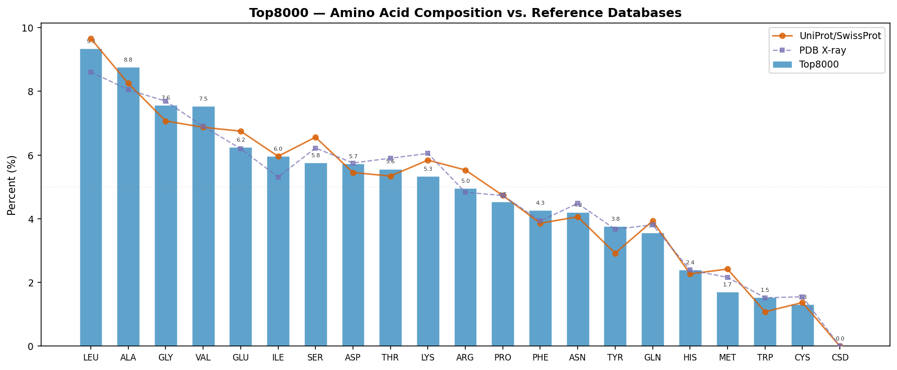
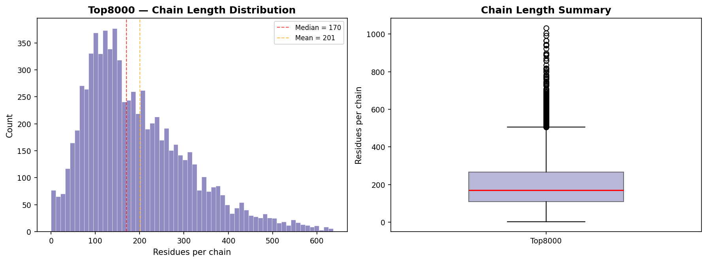
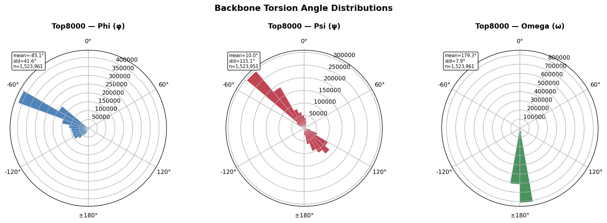
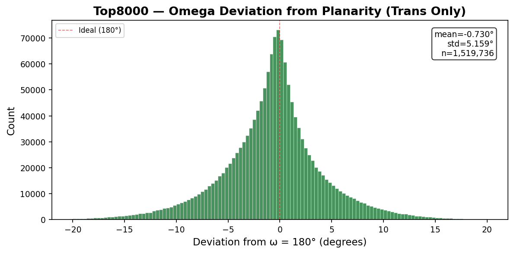
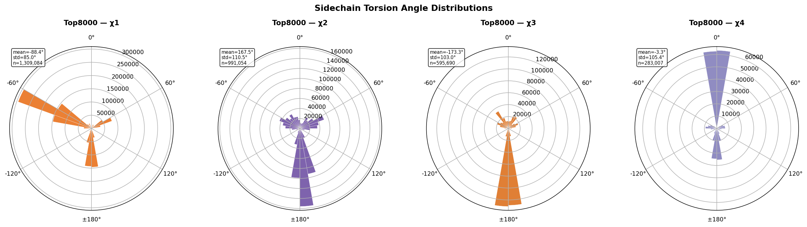
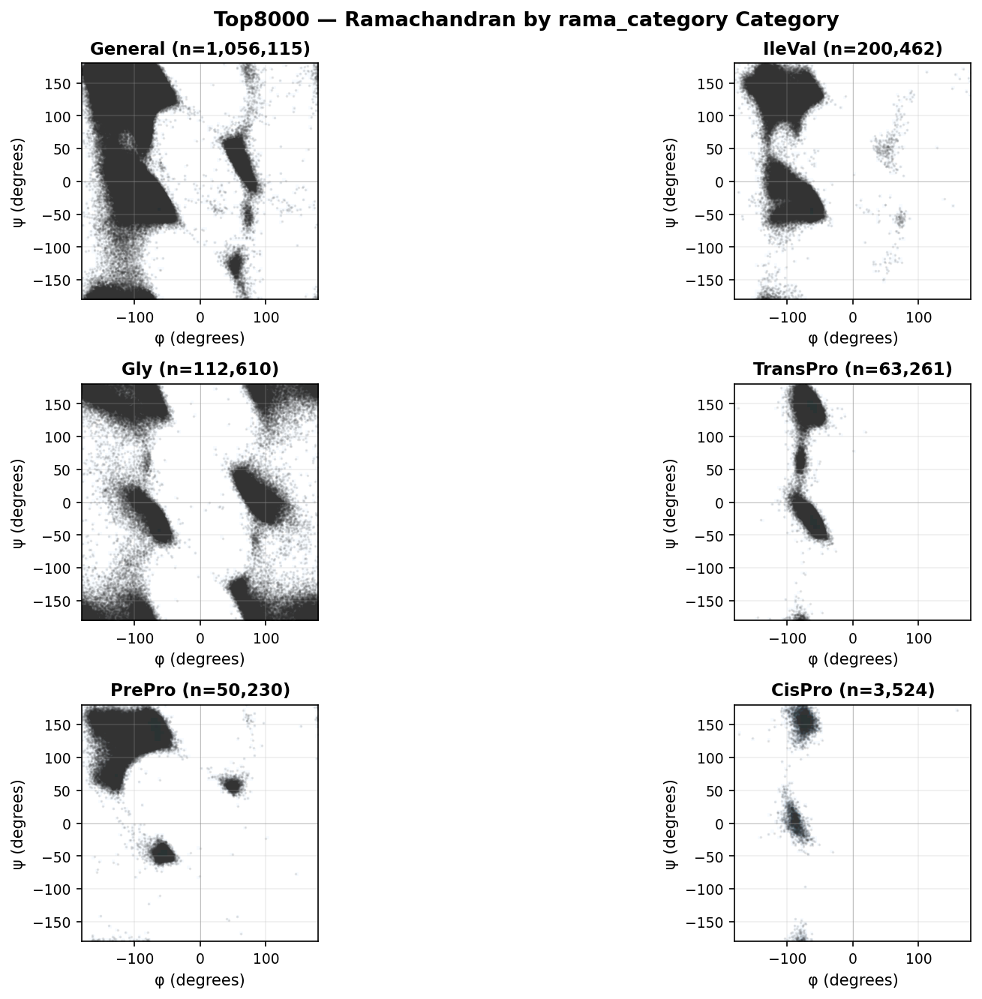
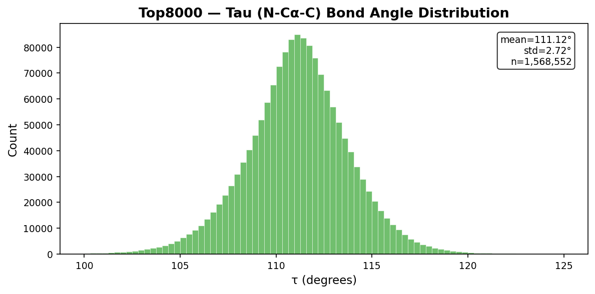

# Top8000 Dataset — General Statistics and Geometric Analysis

**Residues:** 1,568,561 | **Chains:** 7,814 | **Structures:** 7,607
| **Source:** top8000_measures.jsonl
| **Generated by:** pydangle-biopython v0.5.1

This document provides the following analyses:

1. **General Information** — dataset overview, measurements available, and summary statistics
2. **Amino Acid Composition and Chain Length Distribution** — comparison with UniProt and PDB reference databases
3. **Torsion Angle Distributions** — univariate (backbone, omega deviation, sidechain) and multivariate (Ramachandran) distributions using circular statistics
4. **Bond Angle Distributions** — tau (N−Cα−C) and other non-periodic angles using linear statistics
5. **References**

## 1. General Information

| | |
|---|---|
| **Dataset** | Top8000 |
| **Total residues** | 1,568,561 |
| **Unique structures** | 7,607 |
| **Unique chains** | 7,814 |

**Measurements available:** phi: 1,523,961, psi: 1,523,951,
omega: 1,523,961, tau: 1,568,552, chi1: 1,309,084, chi2: 991,054, chi3: 595,690, chi4: 283,007.
Not all residues have all measurements — terminal residues lack phi/psi/omega,
and glycine and alanine lack sidechain chi angles.

    Ramachandran category distribution:
      General      1,056,115  (67.33%)
      IleVal        200,462  (12.78%)
      Gly           112,610  ( 7.18%)
      TransPro       63,261  ( 4.03%)
      PrePro         50,230  ( 3.20%)
      CisPro          3,524  ( 0.22%)
    
    Torsion angles (circular statistics):
      Angle             N    Circ Mean     Circ Std
      -------- ---------- ------------ ------------
      phi       1,523,961      -85.131       41.641
      psi       1,523,951       10.017      115.055
      omega     1,523,961      179.273        7.902
      chi1      1,309,084      -88.407       85.012

      chi2        991,054      167.494      110.466
      chi3        595,690     -173.251      102.960
      chi4        283,007       -3.321      105.364
    
    Bond angles (linear statistics):
      tau       1,568,552      111.121        2.715

## 2. Amino Acid Composition and Chain Length Distribution

### 2.1 Representativeness

The figure and table below compare the Top8000 amino acid frequencies against two
reference databases:

- **UniProt/SwissProt** (~2024): amino acid frequencies across all reviewed protein sequences,
  representing the broadest available view of protein sequence space.
- **PDB X-ray** (~2025): frequencies from a 10,000-entity sample of X-ray crystallographic
  structures in the RCSB Protein Data Bank.

The two reference distributions are highly similar (most amino acids differ by <0.5%),
indicating that the PDB's well-known crystallization bias — overrepresentation of soluble,
globular, well-expressing proteins from model organisms — has only a modest effect on
overall amino acid composition.

The Top8000 dataset (1,568,561 residues from 7,607
structures) shows additional deviations from both references due to
quality filtering, homology reduction, and sample size effects.

    

    

    Residue     Count  Dataset%  UniProt%      PDB%  Δ UniProt
    -------- -------- --------- --------- --------- ----------
    LEU       146,611     9.35%     9.66%     8.61%     -0.31%
    ALA       137,293     8.75%     8.25%     8.05%     +0.50%
    GLY       118,710     7.57%     7.07%     7.69%     +0.50%
    VAL       118,127     7.53%     6.87%     6.90%     +0.66%
    GLU        97,991     6.25%     6.75%     6.20%     -0.50%
    ILE        93,569     5.97%     5.96%     5.31%     +0.01%
    SER        90,238     5.75%     6.56%     6.22%     -0.81%
    ASP        89,811     5.73%     5.45%     5.75%     +0.28%
    THR        87,232     5.56%     5.34%     5.90%     +0.22%
    LYS        83,548     5.33%     5.84%     6.05%     -0.51%
    ARG        77,862     4.96%     5.53%     4.83%     -0.57%
    PRO        71,026     4.53%     4.73%     4.73%     -0.20%
    PHE        66,832     4.26%     3.86%     3.93%     +0.40%
    ASN        65,830     4.20%     4.06%     4.48%     +0.14%
    TYR        58,959     3.76%     2.92%     3.67%     +0.84%
    GLN        55,838     3.56%     3.93%     3.81%     -0.37%
    HIS        37,563     2.39%     2.27%     2.39%     +0.12%
    MET        26,804     1.71%     2.42%     2.16%     -0.71%
    TRP        24,087     1.54%     1.08%     1.52%     +0.46%
    CYS        20,629     1.32%     1.37%     1.55%     -0.05%
    CSD             1     0.00%     0.00%     0.00%     +0.00%

### 2.2 Chain Length Distribution

    

    

    Chain length statistics (7,814 chains):
      Min:             1
      Q1:            108
      Median:        170
      Mean:        200.7
      Q3:            267
      Max:         1,033
      Std:         130.8

## 3. Torsion Angle Distributions (Circular Statistics)

Torsion angles (φ, ψ, ω, χ) are periodic variables defined on the interval
[−180°, +180°]. Standard (linear) arithmetic means and standard deviations
give misleading results when values cluster near the ±180° boundary — for
example, a linear mean of trans peptide bond ω values near +179° and −179°
yields ~0° rather than the correct ~180°. All torsion angle summary statistics
in this report use **circular statistics**: the circular mean is computed as
atan2(⟨sin θ⟩, ⟨cos θ⟩), and the circular standard deviation as √(−2 ln R̄)
where R̄ is the mean resultant length.

### 3.1 Univariate Distributions

#### 3.1.1 Backbone Torsion Angles (φ, ψ, ω)

    

    

#### 3.1.2 Omega Deviation from Planarity (Trans Peptides Only)

    

    

#### 3.1.3 Sidechain Torsion Angles (χ1–χ4)

    

    

### 3.2 Multivariate Distributions

#### 3.2.1 Ramachandran Distributions (φ × ψ by Category)

    

    

    
    Category counts (rama_category):
      General      1,056,115  (67.33%)
      IleVal        200,462  (12.78%)
      Gly           112,610  ( 7.18%)
      TransPro       63,261  ( 4.03%)
      PrePro         50,230  ( 3.20%)
      CisPro          3,524  ( 0.22%)

## 4. Bond Angle Distributions (Linear Statistics)

Bond angles are non-periodic and are analyzed with standard linear
statistics (arithmetic mean, standard deviation).

### 4.1 Tau (N−Cα−C)

    

    

## 5. References

- Lovell, S. C., Davis, I. W., Arendall, W. B. III, de Bakker, P. I. W.,
  Word, J. M., Prisant, M. G., Richardson, J. S., & Richardson, D. C. (2003).
  Structure validation by Cα geometry: φ, ψ and Cβ deviation.
  *Proteins*, 50(3), 437–450. doi:10.1002/prot.10286

- Lovell, S. C., Word, J. M., Richardson, J. S., & Richardson, D. C. (2000).
  The penultimate rotamer library.
  *Proteins*, 40(3), 389–408. doi:10.1002/1097-0134

- Hintze, B. J., Lewis, S. M., Richardson, J. S., & Richardson, D. C. (2016).
  Molprobity's ultimate rotamer-library distributions.
  *Proteins*, 84(9), 1177–1189. doi:10.1002/prot.25039

- Williams, C. J., Headd, J. J., Moriarty, N. W., Prisant, M. G., Videau, L. L.,
  Deis, L. N., Verma, V., Keedy, D. A., Hintze, B. J., Chen, V. B.,
  Jain, S., Lewis, S. M., Arendall, W. B. III, Snoeyink, J., Adams, P. D.,
  Lovell, S. C., Richardson, J. S., & Richardson, D. C. (2018).
  MolProbity: More and better reference data for improved all-atom structure validation.
  *Protein Science*, 27(1), 293–315. doi:10.1002/pro.3330

- Word, J. M., Lovell, S. C., Richardson, J. S., & Richardson, D. C. (1999).
  Asparagine and glutamine: using hydrogen atom contacts in the choice of
  side-chain amide orientation. *Journal of Molecular Biology*, 285(4), 1735–1747.

- Davis, I. W., Leaver-Fay, A., Chen, V. B., Block, J. N., Kapral, G. J.,
  Wang, X., Murray, L. W., Arendall, W. B. III, Snoeyink, J.,
  Richardson, J. S., & Richardson, D. C. (2007).
  MolProbity: all-atom contacts and structure validation for proteins and nucleic acids.
  *Nucleic Acids Research*, 35(Web Server), W375–W383. doi:10.1093/nar/gkm216

- Edison, A. S. (2001). Linus Pauling and the planar peptide bond.
  *Nature Structural Biology*, 8(3), 201–202. doi:10.1038/84921

---

*Generated by pydangle-biopython v0.5.1 and the richardson-dataset-curation analysis pipeline.*

